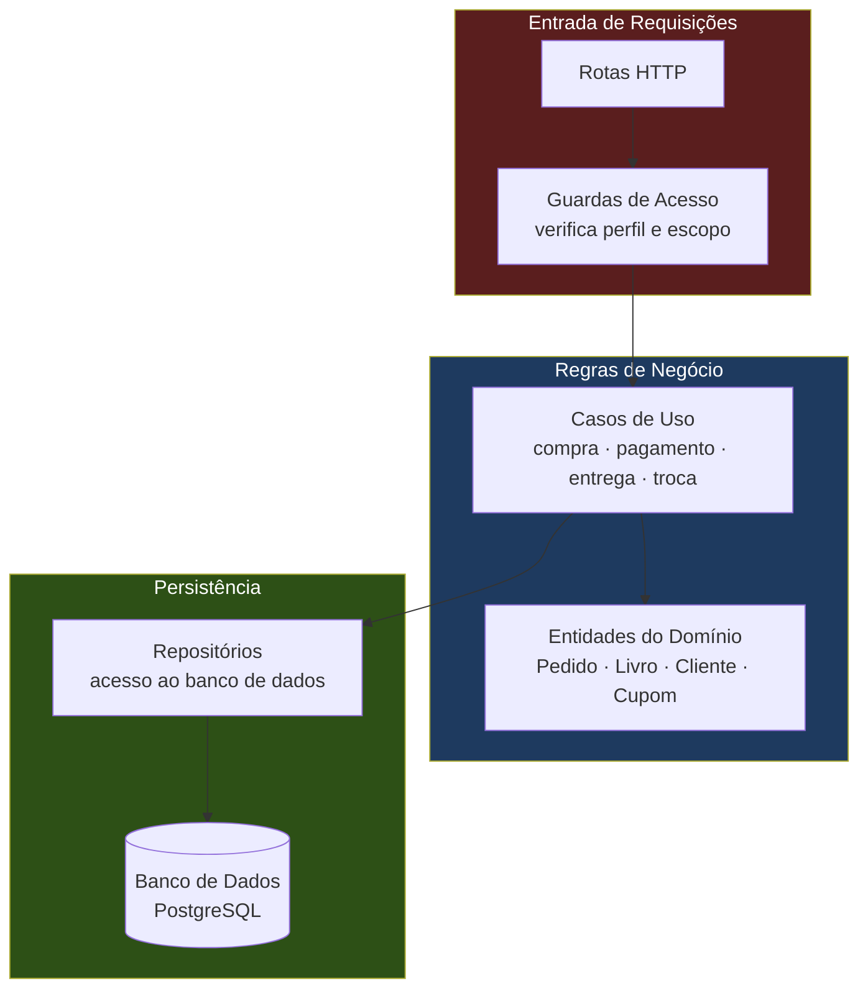
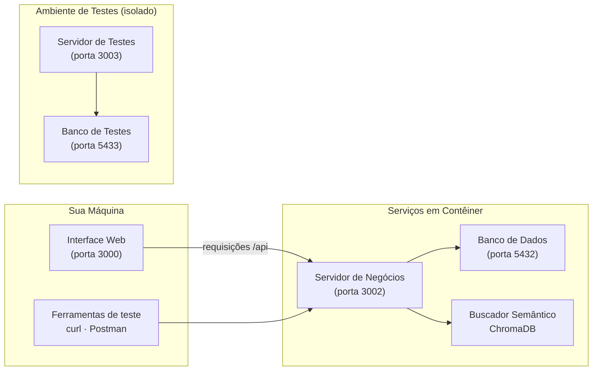
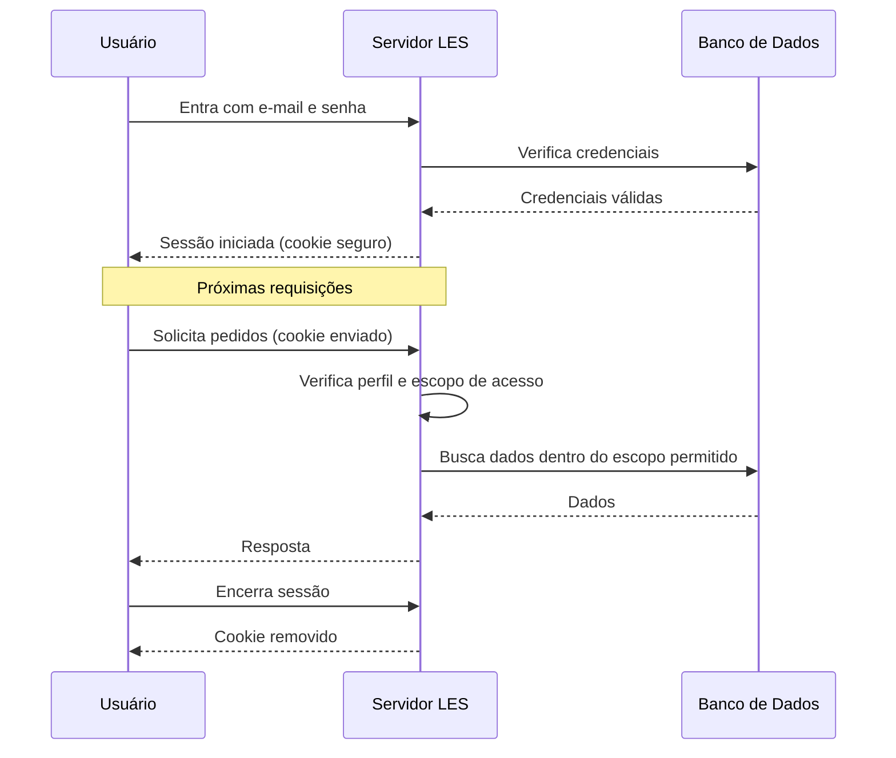
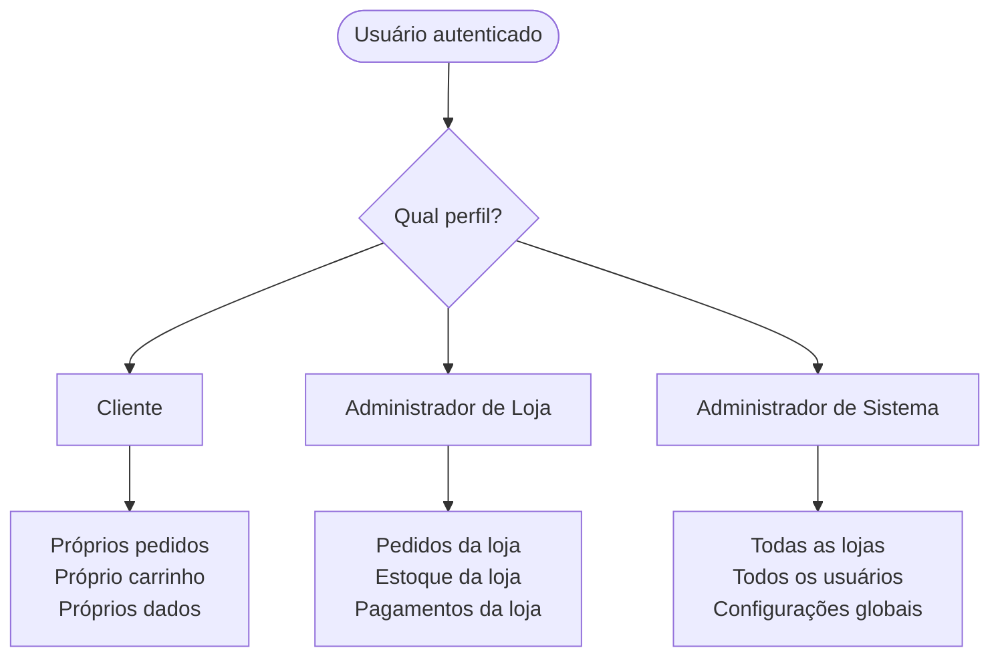

# LES — Servidor de Negócios (Backend)

Responsável por todas as regras de negócio da Livraria E-Commerce: autenticação, catálogo de livros, carrinho, pedidos, pagamentos, entrega, trocas e devoluções. Expõe uma API consumida exclusivamente pela interface web.

---

## Como o Sistema está Organizado

O servidor segue uma separação clara de responsabilidades: as regras de negócio ficam isoladas do banco de dados e dos detalhes de infraestrutura. Isso permite evoluir cada parte independentemente.



---

## Inicialização (Recomendado)

O backend roda em contêineres isolados. O script cuida de subir tudo automaticamente:

```bash
# Na raiz do projeto
./start-backend.sh

# Ou diretamente no backend
cd backend
./scripts/setup-complete.sh
```

O script verifica pré-requisitos, configura o ambiente, sobe os serviços e prepara o banco de dados com dados iniciais.

Veja detalhes completos em [`scripts/README-SETUP.md`](scripts/README-SETUP.md) e [`DOCKER.md`](DOCKER.md).

---

## Ambiente de Execução

O sistema roda em três serviços isolados. Em desenvolvimento, a interface web e as ferramentas de teste acessam o servidor pela porta `3002`:



### Iniciar e Parar os Serviços

```bash
# Iniciar todos os serviços
docker compose up -d

# Parar todos os serviços
docker compose down

# Reiniciar após alterações no código
docker compose restart app

# Reconstruir após alterações no Dockerfile
docker compose up -d --build app
```

### Inicializar sem Contêiner (apenas desenvolvimento rápido)

```bash
npm install
npm run dev   # disponível em http://localhost:3000/api
```

> Copie `.env.example` para `.env` antes de iniciar. Consulte o arquivo para as variáveis necessárias.

---

## Acesso ao Sistema

### Fluxo de Autenticação

A sessão do usuário é estabelecida no login e mantida por um cookie seguro. Cada requisição subsequente carrega esse cookie automaticamente, e o servidor verifica o perfil do usuário antes de liberar qualquer operação.



### Perfis e Escopos de Acesso



### Usuários de Desenvolvimento

Após executar o setup do banco, os seguintes usuários estão disponíveis:

**Clientes**

| Nome | E-mail | Senha |
|------|--------|-------|
| Cliente Teste | `clientetest@email.com` | `ASDF@asdf123` |
| Maria Silva | `cliente1@livraria.com.br` | `ASDF@asdf123` |
| João Santos | `cliente2@livraria.com.br` | `ASDF@asdf123` |

**Administradores de Loja**

| Nome | E-mail | Senha |
|------|--------|-------|
| Admin Teste | `admintest@email.com` | `ASDF@asdf123` |
| Admin Livraria | `admin_loja@livraria.com.br` | `ASDF@asdf123` |

**Administradores de Sistema**

| Nome | E-mail | Senha |
|------|--------|-------|
| Administrador do Sistema | `admin.sistema@livraria.com.br` | `Admin@123` |

> As senhas acima são exclusivas para ambiente local e de testes. Altere o administrador mestre antes de qualquer deploy em produção.

### Exemplo de login via terminal

```bash
# Cliente
curl -s -X POST http://localhost:3002/api/auth/login \
  -H "Content-Type: application/json" \
  -d '{"email":"clientetest@email.com","senha":"ASDF@asdf123"}'

# Administrador de Loja
curl -s -X POST http://localhost:3002/api/auth/login \
  -H "Content-Type: application/json" \
  -d '{"email":"admintest@email.com","senha":"ASDF@asdf123"}'

# Administrador de Sistema
curl -s -X POST http://localhost:3002/api/auth/login \
  -H "Content-Type: application/json" \
  -d '{"email":"admin.sistema@livraria.com.br","senha":"Admin@123"}'
```

---

## Dados para Testes

### CPFs válidos (cadastro de cliente)

O sistema valida o CPF no cadastro. Use um CPF diferente para cada novo cliente de teste:

`245.699.622-46` · `019.364.721-47` · `747.200.643-29` · `371.568.753-37` · `497.592.260-65`
`283.323.987-46` · `206.903.522-04` · `824.477.504-12` · `989.888.819-90` · `267.905.031-29`
`684.262.887-31` · `802.563.243-10` · `087.098.018-12` · `707.848.056-28` · `952.426.835-38`

### Cartões de teste (pagamento)

Use qualquer CVV de 3 dígitos e validade futura:

| Bandeira | Número |
|----------|--------|
| Visa | `4111111111111111` |
| Visa | `4242424242424242` |
| Mastercard | `5555555555554444` |

### Pagamento PIX (simulado)

O PIX em desenvolvimento é simulado. Após selecionar PIX no checkout, confirme o pagamento via:

```bash
curl -s -X POST http://localhost:3002/api/webhooks/pagamento-pix-simulado \
  -H "Content-Type: application/json" \
  -d '{"pagamentoUuid":"<uuid>","segredoConfirmacao":"<segredo>"}'
```

O `segredoConfirmacao` é retornado no momento da seleção do PIX.

### Histórico de vendas para relatórios

Para popular o gráfico de análise de vendas (13 meses de histórico):

```bash
docker exec ecm_postgres psql -U ecm_user -d ecm_livraria \
  < sql/migrations/070_seed_vendas_historicas_13_meses.sql
```

Acesse com `admin_loja@livraria.com.br` / `ASDF@asdf123` para visualizar os relatórios.

---

## Banco de Dados

### Configurar em Novo Ambiente

```bash
# Desenvolvimento
./scripts/implantar-sistema-completo.sh --env dev

# Testes
./scripts/implantar-sistema-completo.sh --env test
```

O script aplica toda a estrutura de tabelas, dados iniciais (cidades, transportadoras, motivos de troca, tipos de cupom) e validações de integridade. O log é salvo em `logs/`.

### Scripts de Banco

| Script | Quando usar |
|--------|-------------|
| `./scripts/setup-db.sh` | Reconstruir banco de desenvolvimento do zero |
| `./scripts/setup-test-db.sh` | Reconstruir banco de testes do zero |
| `./scripts/sync-db-test.sh` | Copiar dados reais de dev para testes |
| `./scripts/reset-db.sh` | Apagar tudo e recriar (destrutivo) |

### Backup e Restauração

```bash
# Gerar backup
docker exec ecm_postgres pg_dump -U ecm_user -d ecm_livraria -n les -Fc > backup_les_$(date +%Y%m%d).dump

# Restaurar backup
docker exec -i ecm_postgres pg_restore -U ecm_user -d ecm_livraria --clean --if-exists < backup_les_...dump
```

---

## Testes Automatizados

Os testes cobrem os domínios de negócio com suítes de integração. Execute a suíte completa ou por domínio:

```bash
# Suíte completa
npm test

# Com relatório de cobertura
npm run test:coverage

# Por domínio de negócio
npm run test:dominio:clientes
npm run test:dominio:vendas
npm run test:dominio:pagamentos
npm run test:dominio:entrega
npm run test:dominio:frete
npm run test:dominio:admin
```

O relatório de cobertura em HTML fica em `coverage/index.html`. Os cenários em linguagem de negócio estão em [`bdd/README.md`](bdd/README.md).

---

## Scripts de Desenvolvimento

| Comando | Descrição |
|---------|-----------|
| `npm run dev` | Iniciar servidor com recarregamento automático |
| `npm run build` | Gerar versão de produção |
| `npm start` | Iniciar versão de produção |
| `npm test` | Executar testes |
| `npm run test:coverage` | Executar testes com relatório de cobertura |
| `./iniciar-docker.sh` | Subir contêineres, verificar API e preparar banco |

---

## Segurança em Testes

- Credenciais de desenvolvimento **nunca** devem ir para produção
- Variáveis de ambiente sensíveis não devem ser versionadas (`.env`, `cypress.env.json`)
- Para os testes E2E, defina as credenciais via variáveis de ambiente: `CYPRESS_ADMIN_EMAIL`, `CYPRESS_ADMIN_SENHA`, `CYPRESS_CLIENTE_EMAIL`, `CYPRESS_CLIENTE_SENHA`
- O endpoint de reset de administrador (`/api/admin/bootstrap`) só funciona em ambiente de testes e requer chave específica

---

## Documentação Relacionada

- [Interface web (Frontend)](../web/README.md)
- [Visão geral do projeto](../README.md)
- [Requisitos e decisões de arquitetura](../documentacao-exigida/README.md)
- [Cenários de negócio (BDD)](bdd/README.md)
- [Estrutura do banco de dados](sql/README.md)
- [Guia de operação Docker](DOCKER.md)
