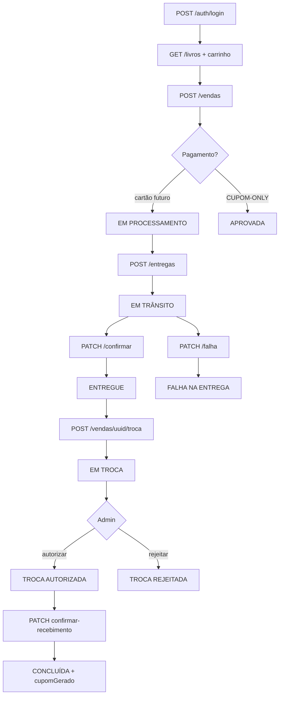

# Exportação BDD — 7ª Entrega (Venda Completa)

Documento gerado por `exportar-bdd-7-entrega-markdown.sh` a partir de `testar-cenarios-bdd-7-entrega.sh`.

| Item | Valor |
|------|-------|
| Base URL | `http://localhost:3002/api` |
| Header loja | `x-loja-id: 1` |
| Cliente | `clientetest@email.com` |
| Admin | `admintest@email.com` |
| Gerado em | 2026-05-18T18:36:27-03:00 |

## Índice de rotas

| # | Método | Rota | Uso nos cenários |
|---|--------|------|------------------|
| 1 | POST | `/auth/login` | Setup (cliente e admin) |
| 2 | GET | `/livros` | Setup catálogo |
| 3 | POST | `/carrinho/itens` | Setup carrinho |
| 4 | GET | `/clientes/perfil` | Setup endereço/cartão |
| 5 | POST | `/vendas` | 1, 3, troca, 6, 7, 10 |
| 6 | POST | `/entregas` | 1, troca, 10 |
| 7 | PATCH | `/entregas/:entregaUuid/confirmar` | 1, troca, 7 |
| 8 | POST | `/pagamento/processar` | 2 (erro), 3 (100% cupom) |
| 9 | GET | `/cupom/disponiveis` | 3 |
| 10 | GET | `/vendas/:uuid` | Detalhe / itens para troca |
| 11 | POST | `/vendas/:uuid/troca` | 4, 6, 7 |
| 12 | PATCH | `/admin/pedidos/:uuid/autorizar-troca` | 5 |
| 13 | PATCH | `/admin/pedidos/:uuid/confirmar-recebimento` | 5 |
| 14 | PATCH | `/admin/pedidos/:uuid/rejeitar-troca` | 6 |
| 15 | GET | `/entregas?vendaUuid=:uuid` | 8, 9 |
| 16 | PATCH | `/entregas/:entregaUuid/falha` | 10 |

## Variações de rotas

| Padrão | Descrição |
|--------|-----------|
| `/vendas/{uuid}` | UUID da venda no path |
| `/vendas/{uuid}/troca` | Cliente solicita troca (body: `motivo`, `itensUuids[]`) |
| `/admin/pedidos/{uuid}/autorizar-troca` | Admin — sem body obrigatório |
| `/admin/pedidos/{uuid}/confirmar-recebimento` | Admin — body: `retornarEstoque: boolean` |
| `/admin/pedidos/{uuid}/rejeitar-troca` | Admin — body: `motivo: string` |
| `/entregas/{entregaUuid}/confirmar` | Venda → `ENTREGUE` + `ven_data_hora_entrega` |
| `/entregas/{entregaUuid}/falha` | Venda → `FALHA NA ENTREGA` (HTTP 204) |
| `/entregas?vendaUuid={uuid}` | Query string — lista entregas da venda |
| `/pagamento/processar` | Checkout: cartões, cupons ou `CUPOM-ONLY` (valorTotal 0) |

---
## Setup global


### `POST http://localhost:3002/api/auth/login`

| Campo | Valor |
|-------|-------|
| Método HTTP | `POST` |
| URL completa | `http://localhost:3002/api/auth/login` |
| Status HTTP | `200` |
| Autenticação | Cookie de sessão |

**Corpo enviado (request)**
```json
{
  "email": "clientetest@email.com",
  "senha": "@asdfJKLÇ123"
}
```

**Resposta (response)**
```json
{
  "sucesso": true,
  "dados": {
    "user": {
      "uuid": "063365ff-29ee-4944-93bd-26a6fda23a10",
      "nome": "Cliente Teste",
      "email": "clientetest@email.com",
      "role": "cliente",
      "papeis": [
        "cliente"
      ],
      "isAdminMestre": false
    }
  }
}
```

### `POST http://localhost:3002/api/auth/login`

| Campo | Valor |
|-------|-------|
| Método HTTP | `POST` |
| URL completa | `http://localhost:3002/api/auth/login` |
| Status HTTP | `200` |
| Autenticação | Cookie de sessão |

**Corpo enviado (request)**
```json
{
  "email": "admintest@email.com",
  "senha": "@asdfJKLÇ123"
}
```

**Resposta (response)**
```json
{
  "sucesso": true,
  "dados": {
    "user": {
      "uuid": "ce2c8338-d625-4c64-82cb-13c96d27c254",
      "nome": "Admin Teste",
      "email": "admintest@email.com",
      "role": "admin",
      "papeis": [
        "admin"
      ],
      "isAdminMestre": false
    }
  }
}
```

### `GET http://localhost:3002/api/livros`

| Campo | Valor |
|-------|-------|
| Método HTTP | `GET` |
| URL completa | `http://localhost:3002/api/livros` |
| Status HTTP | `200` |
| Autenticação | Cookie de sessão |
| Headers extras | `x-loja-id: 1` |

_Sem corpo na requisição._

**Resposta (response)**
```json
{
  "livros": [
    {
      "uuid": "55667788-1122-3344-aabb-ccddeeff0011",
      "titulo": "A Menina que Roubava Livros",
      "autor": "Markus Zusak",
      "preco": "49.90",
      "imagem": "https://m.media-amazon.com/images/I/41pVlY-bbaL._SY445_SX342_ML2_.jpg",
      "isbn": "978-85-325-2019-5",
      "estoque": 10,
      "sinopse": "A Menina que Roubava Livros, de Markus Zusak, é narrado pela Morte e conta a história de Liesel Meminger, uma menina que vive na Alemanha Nazista durante a Segunda Guerra Mundial e encontra nos livros roubados e nas palavras uma forma de resistência e redenção em meio ao horror da guerra.",
      "status": "Ativo",
      "estrelas": 5
    },
    {
      "uuid": "11223344-5566-7788-9900-aabbccddeeff",
      "titulo": "Harry Potter e a Pedra Filosofal",
      "autor": "J.K. Rowling",
      "preco": "44.90",
      "imagem": "https://m.media-amazon.com/images/I/81iqZ2HHD-L._SY466_.jpg",
      "isbn": "978-85-325-2963-1",
      "estoque": 30,
      "sinopse": "Harry Potter e a Pedra Filosofal é o primeiro livro da saga de J.K. Rowling. O órfão Harry descobre em seu 11º aniversário que é um bruxo e parte para a Escola de Magia e Bruxaria de Hogwarts, onde faz amigos e confronta o mistério por trás da Pedra Filosofal e do Lorde Voldemort.",
      "status": "Ativo",
      "estrelas": 5
    },
    {
      "uuid": "87654321-4321-4321-4321-876543210987",
      "titulo": "Código Limpo",
      "autor": "Robert C. Martin",
      "preco": "85.00",
      "imagem": "https://m.media-amazon.com/images/I/41xShlnTZTL._SY466_.jpg",
      "isbn": "978-85-7608-597-1",
      "estoque": 4,
      "sinopse": "Código Limpo (Clean Code) é um guia essencial de Robert C. Martin para desenvolvedores que buscam escrever código de alta qualidade, legível e de fácil manutenção. O livro apresenta princípios, padrões e práticas práticas para transformar código ruim em código limpo e eficiente.",
      "status": "Ativo",
      "estrelas": 5
    },
    {
      "uuid": "23456789-01ab-cdef-1234-567890abcdef",
      "titulo": "A Revolução dos Bichos",
      "autor": "George Orwell",
      "preco": "34.90",
      "imagem": "https://m.media-amazon.com/images/I/81qFYTFvPwL._SY466_.jpg",
      "isbn": "978-85-250-3836-0",
      "estoque": 25,
      "sinopse": "A Revolução dos Bichos é uma sátira política de George Orwell. Os animais de uma fazenda, liderados pelos porcos, expulsam os humanos para criar uma sociedade igualitária, mas gradualmente o poder corrompe o novo regime, revelando como as revoluções podem se transformar nas tiranias que buscavam combater.",
      "status": "Ativo",
      "estrelas": 5
    },
    {
      "uuid": "67890abc-def0-1234-5678-9abcdef01234",
      "titulo": "O Silmarillion",
      "autor": "J.R.R. Tolkien",
      "preco": "59.90",
      "imagem": "https://m.media-amazon.com/images/I/51EZZWkTECL._SY445_SX342_ML2_.jpg",
      "isbn": "978-85-325-1078-3",
      "estoque": 7,
      "sinopse": "O Silmarillion é uma coletânea de mitos e lendas da Terra Média, narrando a criação do mundo por Ilúvatar e a história das Eras anteriores a O Senhor dos Anéis. O livro foca na rebelião de Morgoth, o primeiro Senhor das Trevas, e na luta épica dos elfos para recuperar as Silmarils.",
      "status": "Ativo",
      "estrelas": 5
    },
    {
      "uuid": "98765432-10fe-dcba-0987-654321fedcba",
      "titulo": "O Hobbit",
      "autor": "J.R.R. Tolkien",
      "preco": "49.90",
      "imagem": "https://m.media-amazon.com/images/I/41Gz-OoRQOL._SX342_SY445_ML2_.jpg",
      "isbn": "978-85-8063-226-5",
      "estoque": 15,
      "sinopse": "O Hobbit narra a aventura de Bilbo Bolseiro, um hobbit pacato que é convencido pelo mago Gandalf e um grupo de anões a participar de uma perigosa missão para recuperar um tesouro guardado pelo dragão Smaug. A jornada transforma Bilbo e revela segredos que mudarão o destino da Terra Média.",
      "status": "Ativo",
      "estrelas": 5
    },
    {
      "uuid": "1a2b3c4d-5e6f-7890-abcd-ef0123456789",
      "titulo": "1984 - Edição Atualizada",
      "autor": "George Orwell",
      "preco": "49.90",
      "imagem": "https://m.media-amazon.com/images/I/71XvO7F9uDL._SY466_.jpg",
      "isbn": "978-85-250-6237-2",
      "estoque": 40,
      "sinopse": "1984 é um romance distópico de George Orwell. A história se passa num futuro totalitário sob o regime do Grande Irmão, onde a vigilância é constante e a verdade é manipulada. Winston Smith, o protagonista, trabalha no Ministério da Verdade reescrevendo a história, mas começa a questionar o sistema.",
      "status": "Ativo",
      "estrelas": 5
    },
    {
      "uuid": "f0e1d2c3-b4a5-6789-0123-456789abcdef",
      "titulo": "Duna",
      "autor": "Frank Herbert",
      "preco": "79.90",
      "imagem": "https://m.media-amazon.com/images/I/41MRn6hy8-L._SY445_SX342_ML2_.jpg",
      "isbn": "978-85-250-6166-5",
      "estoque": 8,
      "sinopse": "Duna é uma obra-prima da ficção científica de Frank Herbert. O romance se passa num futuro distante num império intergaláctico, focando em Paul Atreides, herdeiro de uma família nobre encarregada de Arrakis, o planeta desértico onde se encontra a especiaria melange, a substância mais valiosa do universo.",
      "status": "Ativo",
      "estrelas": 5
    },
    {
      "uuid": "b2c3d4e5-f6a7-8901-2345-6789abcdef01",
      "titulo": "Dom Casmurro",
      "autor": "Machado de Assis",
      "preco": "29.90",
      "imagem": "https://m.media-amazon.com/images/I/416E0ngf0xL._SY445_SX342_ML2_.jpg",
      "isbn": "978-85-359-0277-5",
      "estoque": 2,
      "sinopse": "Dom Casmurro, de Machado de Assis, é um romance realista publicado em 1899, considerado uma das obras mais importantes da literatura brasileira. A narrativa é contada em primeira pessoa pelo protagonista, Bento Santiago, que decide escrever suas memórias para ''atar as duas pontas da vida'' e reviver seu passado e sua paixão por Capitu.",
      "status": "Ativo",
      "estrelas": 5
    },
    {
      "uuid": "a1b2c3d4-e5f6-7890-1234-56789abcdef0",
      "titulo": "O Senhor dos Anéis: A Sociedade do Anel",
      "autor": "J.R.R. Tolkien",
      "preco": "79.90",
      "imagem": "https://m.media-amazon.com/images/I/81hCVEC0ExL._SY466_.jpg",
      "isbn": "978-85-325-1077-6",
      "estoque": 12,
      "sinopse": "Numa cidadezinha indolente do Condado, um jovem hobbit é encarregado de uma imensa tarefa. Deve empreender uma perigosa viagem através da Terra-média até as Fendas da Perdição, e lá destruir o Anel do Poder — a única coisa que pode dar ao Senhor das Trevas o poder de escravizar o mundo livre.",
      "status": "Ativo",
      "estrelas": 5
    }
  ],
  "total": 10,
  "pagina": 1,
  "itensPorPagina": 10
}
```

### `POST http://localhost:3002/api/carrinho/itens`

| Campo | Valor |
|-------|-------|
| Método HTTP | `POST` |
| URL completa | `http://localhost:3002/api/carrinho/itens` |
| Status HTTP | `200` |
| Autenticação | Cookie de sessão |

**Corpo enviado (request)**
```json
{
  "livroUuid": "55667788-1122-3344-aabb-ccddeeff0011",
  "quantidade": 2
}
```

**Resposta (response)**
```json
{
  "itens": [
    {
      "uuid": "55667788-1122-3344-aabb-ccddeeff0011",
      "imagem": "https://m.media-amazon.com/images/I/41pVlY-bbaL._SY445_SX342_ML2_.jpg",
      "titulo": "A Menina que Roubava Livros",
      "isbn": "978-85-325-2019-5",
      "precoUnitario": 49.9,
      "quantidade": 2,
      "subtotal": 99.8
    }
  ],
  "fretePadrao": {
    "valor": 15,
    "prazo": "5 a 7 dias úteis"
  },
  "resumo": {
    "subtotal": 99.8,
    "frete": 15,
    "total": 114.8
  }
}
```

### `GET http://localhost:3002/api/clientes/perfil`

| Campo | Valor |
|-------|-------|
| Método HTTP | `GET` |
| URL completa | `http://localhost:3002/api/clientes/perfil` |
| Status HTTP | `200` |
| Autenticação | Cookie de sessão |

_Sem corpo na requisição._

**Resposta (response)**
```json
{
  "sucesso": true,
  "dados": {
    "uuid": "063365ff-29ee-4944-93bd-26a6fda23a10",
    "nome": "Cliente Teste",
    "email": "clientetest@email.com",
    "emailMascarado": "c***t@email.com",
    "cpf": "222.222.222-22",
    "cpfMascarado": "***.222.***-**",
    "genero": "nao_informado",
    "enderecos": [
      {
        "uuid": "522d911d-a4c0-4524-a6c3-3392184982cb",
        "apelido": "Casa",
        "numero": "1000",
        "complemento": "Apto 10",
        "tipoResidencia": "Apartamento",
        "tipoLogradouro": "Vila",
        "logradouro": "Paulista",
        "bairro": "Bela Vista",
        "cep": "01310100",
        "cidade": "São Paulo",
        "estado": "AC",
        "pais": "Brasil"
      }
    ],
    "cartoes": [
      {
        "uuid": "a39c3c85-9ed4-4c14-a7ba-b5a92b138b3a",
        "ultimosDigitosCartao": "0002",
        "nomeImpresso": "CLIENTE TESTE VISA",
        "bandeira": "Visa",
        "validade": "2029-06",
        "principal": true
      }
    ]
  }
}
```
---
## Cenário 1 — Compra com cartão (feliz)

**Descrição:** Cliente registra pedido com cartão. Status inicial `EM PROCESSAMENTO`. Admin agenda entrega e confirma recebimento (`ENTREGUE`).


### `POST http://localhost:3002/api/vendas`

| Campo | Valor |
|-------|-------|
| Método HTTP | `POST` |
| URL completa | `http://localhost:3002/api/vendas` |
| Status HTTP | `201` |
| Autenticação | Cookie de sessão |

**Corpo enviado (request)**
```json
{
  "enderecoUuid": "522d911d-a4c0-4524-a6c3-3392184982cb",
  "cartaoUuid": "a39c3c85-9ed4-4c14-a7ba-b5a92b138b3a",
  "formaPagamento": "cartao",
  "valorTotal": 114.8,
  "valorTotalItens": 99.8,
  "valorFrete": 15,
  "parcelas": 1,
  "itens": [
    {
      "livroUuid": "55667788-1122-3344-aabb-ccddeeff0011",
      "quantidade": 2,
      "precoUnitario": 49.9
    }
  ]
}
```

**Resposta (response)**
```json
{
  "id": "7c309663-7e7c-4f1c-bffa-ed0e194f7479",
  "usuarioUuid": "063365ff-29ee-4944-93bd-26a6fda23a10",
  "status": "EM PROCESSAMENTO",
  "totalItens": 99.8,
  "frete": 15,
  "totalVenda": 114.8,
  "itens": [
    {
      "id": "fd5816df-435e-4450-a825-b2b9129e34cb",
      "livroUuid": "55667788-1122-3344-aabb-ccddeeff0011",
      "quantidade": 2,
      "precoUnitario": 49.9
    }
  ],
  "criadoEm": "2026-05-18T21:36:27.693Z"
}
```
#### Subfluxo: entrega e confirmação

### `POST http://localhost:3002/api/entregas`

| Campo | Valor |
|-------|-------|
| Método HTTP | `POST` |
| URL completa | `http://localhost:3002/api/entregas` |
| Status HTTP | `201` |
| Autenticação | Cookie de sessão |

**Corpo enviado (request)**
```json
{
  "vendaUuid": "7c309663-7e7c-4f1c-bffa-ed0e194f7479",
  "tipoFrete": "PAC",
  "endereco": "Endereço de Teste",
  "custo": 15,
  "entregador": "Transportadora Padrão"
}
```

**Resposta (response)**
```json
{
  "uuid": "366b1198-3f50-4a02-b281-b1968ec291ef",
  "vendaUuid": "7c309663-7e7c-4f1c-bffa-ed0e194f7479",
  "tipoFrete": "PAC",
  "endereco": "Endereço de Teste",
  "custo": 15,
  "entregador": "Transportadora Padrão",
  "criadoEm": "2026-05-18T21:36:27.719Z"
}
```

### `PATCH http://localhost:3002/api/entregas/366b1198-3f50-4a02-b281-b1968ec291ef/confirmar`

| Campo | Valor |
|-------|-------|
| Método HTTP | `PATCH` |
| URL completa | `http://localhost:3002/api/entregas/366b1198-3f50-4a02-b281-b1968ec291ef/confirmar` |
| Status HTTP | `204` |
| Autenticação | Cookie de sessão |

_Sem corpo na requisição._

**Resposta (response):** corpo vazio (típico de HTTP 204).
---
## Cenário 2 — Falha no pagamento (payload inválido)

**Descrição:** Checkout sem campos obrigatórios retorna `400` com mensagem de erro.


### `POST http://localhost:3002/api/pagamento/processar`

| Campo | Valor |
|-------|-------|
| Método HTTP | `POST` |
| URL completa | `http://localhost:3002/api/pagamento/processar` |
| Status HTTP | `400` |
| Autenticação | Cookie de sessão |

_Sem corpo na requisição._

**Resposta (response)**
```json
{
  "erro": "Payload inválido"
}
```
---
## Cenário 3 — Pagamento 100% cupom de troca

**Descrição:** Venda coberta integralmente por cupom (`CUPOM-ONLY`, `pagamentosCartao: []`). Esperado: `sucesso: true` e venda `APROVADA`.


### `GET http://localhost:3002/api/cupom/disponiveis`

| Campo | Valor |
|-------|-------|
| Método HTTP | `GET` |
| URL completa | `http://localhost:3002/api/cupom/disponiveis` |
| Status HTTP | `200` |
| Autenticação | Cookie de sessão |

_Sem corpo na requisição._

**Resposta (response)**
```json
{
  "ok": true,
  "dados": [
    {
      "uuid": "uuid-descuento10",
      "codigo": "DESCONTO10",
      "tipo": "promocional",
      "valorDesconto": 10,
      "valorMinimo": 0
    },
    {
      "uuid": "uuid-descuento20",
      "codigo": "DESCONTO20",
      "tipo": "promocional",
      "valorDesconto": 20,
      "valorMinimo": 50
    },
    {
      "uuid": "uuid-troca50",
      "codigo": "TROCA50",
      "tipo": "troca",
      "valorDesconto": 50,
      "valorMinimo": 0
    },
    {
      "uuid": "uuid-troca30",
      "codigo": "TROCA30",
      "tipo": "troca",
      "valorDesconto": 30,
      "valorMinimo": 0
    }
  ]
}
```

### `POST http://localhost:3002/api/vendas`

| Campo | Valor |
|-------|-------|
| Método HTTP | `POST` |
| URL completa | `http://localhost:3002/api/vendas` |
| Status HTTP | `201` |
| Autenticação | Cookie de sessão |

**Corpo enviado (request)**
```json
{
  "enderecoUuid": "522d911d-a4c0-4524-a6c3-3392184982cb",
  "cartaoUuid": "a39c3c85-9ed4-4c14-a7ba-b5a92b138b3a",
  "formaPagamento": "cupom",
  "valorTotal": 50,
  "valorTotalItens": 50,
  "valorFrete": 0,
  "parcelas": 1,
  "itens": [
    {
      "livroUuid": "55667788-1122-3344-aabb-ccddeeff0011",
      "quantidade": 1,
      "precoUnitario": 50
    }
  ]
}
```

**Resposta (response)**
```json
{
  "id": "d8795063-e099-4233-874a-babe7e05f6be",
  "usuarioUuid": "063365ff-29ee-4944-93bd-26a6fda23a10",
  "status": "EM PROCESSAMENTO",
  "totalItens": 50,
  "frete": 0,
  "totalVenda": 50,
  "itens": [
    {
      "id": "e00116f1-1e27-401c-b9a0-a26388f43a4e",
      "livroUuid": "55667788-1122-3344-aabb-ccddeeff0011",
      "quantidade": 1,
      "precoUnitario": 50
    }
  ],
  "criadoEm": "2026-05-18T21:36:27.792Z"
}
```

### `POST http://localhost:3002/api/pagamento/processar`

| Campo | Valor |
|-------|-------|
| Método HTTP | `POST` |
| URL completa | `http://localhost:3002/api/pagamento/processar` |
| Status HTTP | `200` |
| Autenticação | Cookie de sessão |

**Corpo enviado (request)**
```json
{
  "vendaUuid": "d8795063-e099-4233-874a-babe7e05f6be",
  "valorTotal": 0,
  "idIntencao": "CUPOM-ONLY",
  "segredoConfirmacao": "CUPOM-ONLY",
  "pagamentosCartao": [],
  "cuponsAplicados": [
    {
      "uuid": "uuid-troca50",
      "codigo": "TROCA50",
      "tipo": "troca",
      "valor": 50
    }
  ]
}
```

**Resposta (response)**
```json
{
  "sucesso": true,
  "pedidoUuid": "d8795063-e099-4233-874a-babe7e05f6be",
  "status": "APROVADA",
  "pagamentoUuid": "dde00b44-4496-4068-b047-7c728010ede4"
}
```

### `GET http://localhost:3002/api/vendas/d8795063-e099-4233-874a-babe7e05f6be`

| Campo | Valor |
|-------|-------|
| Método HTTP | `GET` |
| URL completa | `http://localhost:3002/api/vendas/d8795063-e099-4233-874a-babe7e05f6be` |
| Status HTTP | `200` |
| Autenticação | Cookie de sessão |

_Sem corpo na requisição._

**Resposta (response)**
```json
{
  "id": "d8795063-e099-4233-874a-babe7e05f6be",
  "usuarioUuid": "063365ff-29ee-4944-93bd-26a6fda23a10",
  "status": "APROVADA",
  "totalItens": 50,
  "frete": 0,
  "totalVenda": 50,
  "criadoEm": "2026-05-18T21:36:27.792Z",
  "itens": [
    {
      "id": "e00116f1-1e27-401c-b9a0-a26388f43a4e",
      "livroUuid": "55667788-1122-3344-aabb-ccddeeff0011",
      "quantidade": 1,
      "precoUnitario": 50,
      "emTroca": false
    }
  ]
}
```
---
## Setup — Pedido entregue (cenários 4 a 6)


### `POST http://localhost:3002/api/vendas`

| Campo | Valor |
|-------|-------|
| Método HTTP | `POST` |
| URL completa | `http://localhost:3002/api/vendas` |
| Status HTTP | `201` |
| Autenticação | Cookie de sessão |

**Corpo enviado (request)**
```json
{
  "enderecoUuid": "522d911d-a4c0-4524-a6c3-3392184982cb",
  "cartaoUuid": "a39c3c85-9ed4-4c14-a7ba-b5a92b138b3a",
  "formaPagamento": "cartao",
  "valorTotal": 114.8,
  "valorTotalItens": 99.8,
  "valorFrete": 15,
  "parcelas": 1,
  "itens": [
    {
      "livroUuid": "55667788-1122-3344-aabb-ccddeeff0011",
      "quantidade": 1,
      "precoUnitario": 49.9
    }
  ]
}
```

**Resposta (response)**
```json
{
  "id": "d5326221-cc5e-4754-b662-bf2c8f8984cc",
  "usuarioUuid": "063365ff-29ee-4944-93bd-26a6fda23a10",
  "status": "EM PROCESSAMENTO",
  "totalItens": 99.8,
  "frete": 15,
  "totalVenda": 114.8,
  "itens": [
    {
      "id": "fefcb526-f749-4545-b726-24b400408cf1",
      "livroUuid": "55667788-1122-3344-aabb-ccddeeff0011",
      "quantidade": 1,
      "precoUnitario": 49.9
    }
  ],
  "criadoEm": "2026-05-18T21:36:27.853Z"
}
```

### `POST http://localhost:3002/api/entregas`

| Campo | Valor |
|-------|-------|
| Método HTTP | `POST` |
| URL completa | `http://localhost:3002/api/entregas` |
| Status HTTP | `201` |
| Autenticação | Cookie de sessão |

**Corpo enviado (request)**
```json
{
  "vendaUuid": "d5326221-cc5e-4754-b662-bf2c8f8984cc",
  "tipoFrete": "PAC",
  "endereco": "Endereço de Teste",
  "custo": 15,
  "entregador": "Transportadora Padrão"
}
```

**Resposta (response)**
```json
{
  "uuid": "0130bcfa-18d7-46fa-a7c1-af64f14d2941",
  "vendaUuid": "d5326221-cc5e-4754-b662-bf2c8f8984cc",
  "tipoFrete": "PAC",
  "endereco": "Endereço de Teste",
  "custo": 15,
  "entregador": "Transportadora Padrão",
  "criadoEm": "2026-05-18T21:36:27.874Z"
}
```

### `PATCH http://localhost:3002/api/entregas/0130bcfa-18d7-46fa-a7c1-af64f14d2941/confirmar`

| Campo | Valor |
|-------|-------|
| Método HTTP | `PATCH` |
| URL completa | `http://localhost:3002/api/entregas/0130bcfa-18d7-46fa-a7c1-af64f14d2941/confirmar` |
| Status HTTP | `204` |
| Autenticação | Cookie de sessão |

_Sem corpo na requisição._

**Resposta (response):** corpo vazio (típico de HTTP 204).

### `GET http://localhost:3002/api/vendas/d5326221-cc5e-4754-b662-bf2c8f8984cc`

| Campo | Valor |
|-------|-------|
| Método HTTP | `GET` |
| URL completa | `http://localhost:3002/api/vendas/d5326221-cc5e-4754-b662-bf2c8f8984cc` |
| Status HTTP | `200` |
| Autenticação | Cookie de sessão |

_Sem corpo na requisição._

**Resposta (response)**
```json
{
  "id": "d5326221-cc5e-4754-b662-bf2c8f8984cc",
  "usuarioUuid": "063365ff-29ee-4944-93bd-26a6fda23a10",
  "status": "ENTREGUE",
  "totalItens": 99.8,
  "frete": 15,
  "totalVenda": 114.8,
  "criadoEm": "2026-05-18T21:36:27.853Z",
  "dataHoraEntrega": "2026-05-18T21:36:27.894Z",
  "itens": [
    {
      "id": "fefcb526-f749-4545-b726-24b400408cf1",
      "livroUuid": "55667788-1122-3344-aabb-ccddeeff0011",
      "quantidade": 1,
      "precoUnitario": 49.9,
      "emTroca": false
    }
  ]
}
```
---
## Cenário 4 — Solicitar troca (feliz)

**Descrição:** Cliente solicita troca de item. Status → `EM TROCA`.


### `POST http://localhost:3002/api/vendas/d5326221-cc5e-4754-b662-bf2c8f8984cc/troca`

| Campo | Valor |
|-------|-------|
| Método HTTP | `POST` |
| URL completa | `http://localhost:3002/api/vendas/d5326221-cc5e-4754-b662-bf2c8f8984cc/troca` |
| Status HTTP | `200` |
| Autenticação | Cookie de sessão |

**Corpo enviado (request)**
```json
{
  "motivo": "Produto não atendeu expectativas",
  "itensUuids": [
    "fefcb526-f749-4545-b726-24b400408cf1"
  ]
}
```

**Resposta (response)**
```json
{
  "id": "d5326221-cc5e-4754-b662-bf2c8f8984cc",
  "usuarioUuid": "063365ff-29ee-4944-93bd-26a6fda23a10",
  "status": "EM TROCA",
  "totalItens": 99.8,
  "frete": 15,
  "totalVenda": 114.8,
  "criadoEm": "2026-05-18T21:36:27.853Z",
  "dataHoraEntrega": "2026-05-18T21:36:27.894Z",
  "motivoTroca": "Produto não atendeu expectativas",
  "itens": [
    {
      "id": "fefcb526-f749-4545-b726-24b400408cf1",
      "livroUuid": "55667788-1122-3344-aabb-ccddeeff0011",
      "quantidade": 1,
      "precoUnitario": 49.9,
      "emTroca": true
    }
  ]
}
```
---
## Cenário 5 — Aprovar troca e gerar cupom (feliz)

**Descrição:** Admin autoriza → `TROCA AUTORIZADA`. Confirma recebimento → `CONCLUÍDA` + objeto `cupomGerado`.


### `PATCH http://localhost:3002/api/admin/pedidos/d5326221-cc5e-4754-b662-bf2c8f8984cc/autorizar-troca`

| Campo | Valor |
|-------|-------|
| Método HTTP | `PATCH` |
| URL completa | `http://localhost:3002/api/admin/pedidos/d5326221-cc5e-4754-b662-bf2c8f8984cc/autorizar-troca` |
| Status HTTP | `200` |
| Autenticação | Cookie de sessão |

_Sem corpo na requisição._

**Resposta (response)**
```json
{
  "id": "d5326221-cc5e-4754-b662-bf2c8f8984cc",
  "usuarioUuid": "063365ff-29ee-4944-93bd-26a6fda23a10",
  "status": "TROCA AUTORIZADA",
  "totalItens": 99.8,
  "frete": 15,
  "totalVenda": 114.8,
  "criadoEm": "2026-05-18T21:36:27.853Z",
  "dataHoraEntrega": "2026-05-18T21:36:27.894Z",
  "motivoTroca": "Produto não atendeu expectativas",
  "itens": [
    {
      "id": "fefcb526-f749-4545-b726-24b400408cf1",
      "livroUuid": "55667788-1122-3344-aabb-ccddeeff0011",
      "quantidade": 1,
      "precoUnitario": 49.9,
      "emTroca": true
    }
  ]
}
```

### `PATCH http://localhost:3002/api/admin/pedidos/d5326221-cc5e-4754-b662-bf2c8f8984cc/confirmar-recebimento`

| Campo | Valor |
|-------|-------|
| Método HTTP | `PATCH` |
| URL completa | `http://localhost:3002/api/admin/pedidos/d5326221-cc5e-4754-b662-bf2c8f8984cc/confirmar-recebimento` |
| Status HTTP | `200` |
| Autenticação | Cookie de sessão |

**Corpo enviado (request)**
```json
{
  "retornarEstoque": true
}
```

**Resposta (response)**
```json
{
  "pedido": {
    "id": "d5326221-cc5e-4754-b662-bf2c8f8984cc",
    "usuarioUuid": "063365ff-29ee-4944-93bd-26a6fda23a10",
    "status": "CONCLUÍDA",
    "totalItens": 99.8,
    "frete": 15,
    "totalVenda": 114.8,
    "criadoEm": "2026-05-18T21:36:27.853Z",
    "dataHoraEntrega": "2026-05-18T21:36:27.894Z",
    "motivoTroca": "Produto não atendeu expectativas",
    "itens": [
      {
        "id": "fefcb526-f749-4545-b726-24b400408cf1",
        "livroUuid": "55667788-1122-3344-aabb-ccddeeff0011",
        "quantidade": 1,
        "precoUnitario": 49.9,
        "emTroca": true
      }
    ]
  },
  "cupomGerado": {
    "codigo": "TROCA-D5326221",
    "valor": 49.9
  }
}
```
---
## Cenário 6 — Troca rejeitada (falha)


### `POST http://localhost:3002/api/vendas`

| Campo | Valor |
|-------|-------|
| Método HTTP | `POST` |
| URL completa | `http://localhost:3002/api/vendas` |
| Status HTTP | `201` |
| Autenticação | Cookie de sessão |

**Corpo enviado (request)**
```json
{
  "enderecoUuid": "522d911d-a4c0-4524-a6c3-3392184982cb",
  "cartaoUuid": "a39c3c85-9ed4-4c14-a7ba-b5a92b138b3a",
  "formaPagamento": "cartao",
  "valorTotal": 64.9,
  "valorTotalItens": 49.9,
  "valorFrete": 15,
  "parcelas": 1,
  "itens": [
    {
      "livroUuid": "55667788-1122-3344-aabb-ccddeeff0011",
      "quantidade": 1,
      "precoUnitario": 49.9
    }
  ]
}
```

**Resposta (response)**
```json
{
  "id": "c8ad7165-8ea9-4d6c-9785-a95ad2b56e67",
  "usuarioUuid": "063365ff-29ee-4944-93bd-26a6fda23a10",
  "status": "EM PROCESSAMENTO",
  "totalItens": 49.9,
  "frete": 15,
  "totalVenda": 64.9,
  "itens": [
    {
      "id": "af5145bb-afc6-4c28-94cd-a2a51f3939fa",
      "livroUuid": "55667788-1122-3344-aabb-ccddeeff0011",
      "quantidade": 1,
      "precoUnitario": 49.9
    }
  ],
  "criadoEm": "2026-05-18T21:36:27.977Z"
}
```

### `POST http://localhost:3002/api/entregas`

| Campo | Valor |
|-------|-------|
| Método HTTP | `POST` |
| URL completa | `http://localhost:3002/api/entregas` |
| Status HTTP | `201` |
| Autenticação | Cookie de sessão |

**Corpo enviado (request)**
```json
{
  "vendaUuid": "c8ad7165-8ea9-4d6c-9785-a95ad2b56e67",
  "tipoFrete": "PAC",
  "endereco": "Endereço de Teste",
  "custo": 15,
  "entregador": "Transportadora Padrão"
}
```

**Resposta (response)**
```json
{
  "uuid": "109e2603-cebe-481a-bcc5-7378258362b6",
  "vendaUuid": "c8ad7165-8ea9-4d6c-9785-a95ad2b56e67",
  "tipoFrete": "PAC",
  "endereco": "Endereço de Teste",
  "custo": 15,
  "entregador": "Transportadora Padrão",
  "criadoEm": "2026-05-18T21:36:27.998Z"
}
```

### `PATCH http://localhost:3002/api/entregas/109e2603-cebe-481a-bcc5-7378258362b6/confirmar`

| Campo | Valor |
|-------|-------|
| Método HTTP | `PATCH` |
| URL completa | `http://localhost:3002/api/entregas/109e2603-cebe-481a-bcc5-7378258362b6/confirmar` |
| Status HTTP | `204` |
| Autenticação | Cookie de sessão |

_Sem corpo na requisição._

**Resposta (response):** corpo vazio (típico de HTTP 204).

### `GET http://localhost:3002/api/vendas/c8ad7165-8ea9-4d6c-9785-a95ad2b56e67`

| Campo | Valor |
|-------|-------|
| Método HTTP | `GET` |
| URL completa | `http://localhost:3002/api/vendas/c8ad7165-8ea9-4d6c-9785-a95ad2b56e67` |
| Status HTTP | `200` |
| Autenticação | Cookie de sessão |

_Sem corpo na requisição._

**Resposta (response)**
```json
{
  "id": "c8ad7165-8ea9-4d6c-9785-a95ad2b56e67",
  "usuarioUuid": "063365ff-29ee-4944-93bd-26a6fda23a10",
  "status": "ENTREGUE",
  "totalItens": 49.9,
  "frete": 15,
  "totalVenda": 64.9,
  "criadoEm": "2026-05-18T21:36:27.977Z",
  "dataHoraEntrega": "2026-05-18T21:36:28.017Z",
  "itens": [
    {
      "id": "af5145bb-afc6-4c28-94cd-a2a51f3939fa",
      "livroUuid": "55667788-1122-3344-aabb-ccddeeff0011",
      "quantidade": 1,
      "precoUnitario": 49.9,
      "emTroca": false
    }
  ]
}
```

### `POST http://localhost:3002/api/vendas/c8ad7165-8ea9-4d6c-9785-a95ad2b56e67/troca`

| Campo | Valor |
|-------|-------|
| Método HTTP | `POST` |
| URL completa | `http://localhost:3002/api/vendas/c8ad7165-8ea9-4d6c-9785-a95ad2b56e67/troca` |
| Status HTTP | `200` |
| Autenticação | Cookie de sessão |

**Corpo enviado (request)**
```json
{
  "motivo": "Produto com defeito",
  "itensUuids": [
    "af5145bb-afc6-4c28-94cd-a2a51f3939fa"
  ]
}
```

**Resposta (response)**
```json
{
  "id": "c8ad7165-8ea9-4d6c-9785-a95ad2b56e67",
  "usuarioUuid": "063365ff-29ee-4944-93bd-26a6fda23a10",
  "status": "EM TROCA",
  "totalItens": 49.9,
  "frete": 15,
  "totalVenda": 64.9,
  "criadoEm": "2026-05-18T21:36:27.977Z",
  "dataHoraEntrega": "2026-05-18T21:36:28.017Z",
  "motivoTroca": "Produto com defeito",
  "itens": [
    {
      "id": "af5145bb-afc6-4c28-94cd-a2a51f3939fa",
      "livroUuid": "55667788-1122-3344-aabb-ccddeeff0011",
      "quantidade": 1,
      "precoUnitario": 49.9,
      "emTroca": true
    }
  ]
}
```

### `PATCH http://localhost:3002/api/admin/pedidos/c8ad7165-8ea9-4d6c-9785-a95ad2b56e67/rejeitar-troca`

| Campo | Valor |
|-------|-------|
| Método HTTP | `PATCH` |
| URL completa | `http://localhost:3002/api/admin/pedidos/c8ad7165-8ea9-4d6c-9785-a95ad2b56e67/rejeitar-troca` |
| Status HTTP | `200` |
| Autenticação | Cookie de sessão |

**Corpo enviado (request)**
```json
{
  "motivo": "Produto danificado"
}
```

**Resposta (response)**
```json
{
  "id": "c8ad7165-8ea9-4d6c-9785-a95ad2b56e67",
  "usuarioUuid": "063365ff-29ee-4944-93bd-26a6fda23a10",
  "status": "TROCA REJEITADA",
  "totalItens": 49.9,
  "frete": 15,
  "totalVenda": 64.9,
  "criadoEm": "2026-05-18T21:36:27.977Z",
  "dataHoraEntrega": "2026-05-18T21:36:28.017Z",
  "motivoTroca": "Produto com defeito",
  "itens": [
    {
      "id": "af5145bb-afc6-4c28-94cd-a2a51f3939fa",
      "livroUuid": "55667788-1122-3344-aabb-ccddeeff0011",
      "quantidade": 1,
      "precoUnitario": 49.9,
      "emTroca": true
    }
  ]
}
```
---
## Cenário 7 — Prazo de 7 dias expirado (exceção)

**Descrição:** Após entrega, data retrocedida 8 dias no banco (RN0043). Nova solicitação de troca é bloqueada.

**Pré-condição (SQL, não é rota HTTP):**
```sql
UPDATE livraria_comercial.vendas
SET ven_data_hora_entrega = NOW() - INTERVAL '8 days'
WHERE ven_uuid = '<uuid-da-venda>';
```


### `POST http://localhost:3002/api/vendas`

| Campo | Valor |
|-------|-------|
| Método HTTP | `POST` |
| URL completa | `http://localhost:3002/api/vendas` |
| Status HTTP | `201` |
| Autenticação | Cookie de sessão |

**Corpo enviado (request)**
```json
{
  "enderecoUuid": "522d911d-a4c0-4524-a6c3-3392184982cb",
  "cartaoUuid": "a39c3c85-9ed4-4c14-a7ba-b5a92b138b3a",
  "formaPagamento": "cartao",
  "valorTotal": 64.9,
  "valorTotalItens": 49.9,
  "valorFrete": 15,
  "parcelas": 1,
  "itens": [
    {
      "livroUuid": "55667788-1122-3344-aabb-ccddeeff0011",
      "quantidade": 1,
      "precoUnitario": 49.9
    }
  ]
}
```

**Resposta (response)**
```json
{
  "id": "435fe6c9-da2b-4c11-9c05-1d250ad53010",
  "usuarioUuid": "063365ff-29ee-4944-93bd-26a6fda23a10",
  "status": "EM PROCESSAMENTO",
  "totalItens": 49.9,
  "frete": 15,
  "totalVenda": 64.9,
  "itens": [
    {
      "id": "00d17182-4433-44ae-89f1-a0528b25cc3f",
      "livroUuid": "55667788-1122-3344-aabb-ccddeeff0011",
      "quantidade": 1,
      "precoUnitario": 49.9
    }
  ],
  "criadoEm": "2026-05-18T21:36:28.081Z"
}
```

### `POST http://localhost:3002/api/entregas`

| Campo | Valor |
|-------|-------|
| Método HTTP | `POST` |
| URL completa | `http://localhost:3002/api/entregas` |
| Status HTTP | `201` |
| Autenticação | Cookie de sessão |

**Corpo enviado (request)**
```json
{
  "vendaUuid": "435fe6c9-da2b-4c11-9c05-1d250ad53010",
  "tipoFrete": "PAC",
  "endereco": "Endereço de Teste",
  "custo": 15,
  "entregador": "Transportadora Padrão"
}
```

**Resposta (response)**
```json
{
  "uuid": "84809112-ad31-47af-9dac-65b5ddf213e8",
  "vendaUuid": "435fe6c9-da2b-4c11-9c05-1d250ad53010",
  "tipoFrete": "PAC",
  "endereco": "Endereço de Teste",
  "custo": 15,
  "entregador": "Transportadora Padrão",
  "criadoEm": "2026-05-18T21:36:28.103Z"
}
```

### `PATCH http://localhost:3002/api/entregas/84809112-ad31-47af-9dac-65b5ddf213e8/confirmar`

| Campo | Valor |
|-------|-------|
| Método HTTP | `PATCH` |
| URL completa | `http://localhost:3002/api/entregas/84809112-ad31-47af-9dac-65b5ddf213e8/confirmar` |
| Status HTTP | `204` |
| Autenticação | Cookie de sessão |

_Sem corpo na requisição._

**Resposta (response):** corpo vazio (típico de HTTP 204).

### `GET http://localhost:3002/api/vendas/435fe6c9-da2b-4c11-9c05-1d250ad53010`

| Campo | Valor |
|-------|-------|
| Método HTTP | `GET` |
| URL completa | `http://localhost:3002/api/vendas/435fe6c9-da2b-4c11-9c05-1d250ad53010` |
| Status HTTP | `200` |
| Autenticação | Cookie de sessão |

_Sem corpo na requisição._

**Resposta (response)**
```json
{
  "id": "435fe6c9-da2b-4c11-9c05-1d250ad53010",
  "usuarioUuid": "063365ff-29ee-4944-93bd-26a6fda23a10",
  "status": "ENTREGUE",
  "totalItens": 49.9,
  "frete": 15,
  "totalVenda": 64.9,
  "criadoEm": "2026-05-18T21:36:28.081Z",
  "dataHoraEntrega": "2026-05-10T21:36:28.181Z",
  "itens": [
    {
      "id": "00d17182-4433-44ae-89f1-a0528b25cc3f",
      "livroUuid": "55667788-1122-3344-aabb-ccddeeff0011",
      "quantidade": 1,
      "precoUnitario": 49.9,
      "emTroca": false
    }
  ]
}
```

### `POST http://localhost:3002/api/vendas/435fe6c9-da2b-4c11-9c05-1d250ad53010/troca`

| Campo | Valor |
|-------|-------|
| Método HTTP | `POST` |
| URL completa | `http://localhost:3002/api/vendas/435fe6c9-da2b-4c11-9c05-1d250ad53010/troca` |
| Status HTTP | `400` |
| Autenticação | Cookie de sessão |

**Corpo enviado (request)**
```json
{
  "motivo": "Teste prazo expirado",
  "itensUuids": [
    "00d17182-4433-44ae-89f1-a0528b25cc3f"
  ]
}
```

**Resposta (response)**
```json
{
  "erro": "Prazo de 7 dias para troca expirado"
}
```
---
## Cenário 8 — Saída para entrega (consulta)

**Descrição:** Lista entregas vinculadas à venda (após `POST /entregas` a venda fica `EM TRÂNSITO`).


### `GET http://localhost:3002/api/entregas?vendaUuid=7c309663-7e7c-4f1c-bffa-ed0e194f7479`

| Campo | Valor |
|-------|-------|
| Método HTTP | `GET` |
| URL completa | `http://localhost:3002/api/entregas?vendaUuid=7c309663-7e7c-4f1c-bffa-ed0e194f7479` |
| Status HTTP | `200` |
| Autenticação | Cookie de sessão |

_Sem corpo na requisição._

**Resposta (response)**
```json
[
  {
    "uuid": "366b1198-3f50-4a02-b281-b1968ec291ef",
    "vendaUuid": "7c309663-7e7c-4f1c-bffa-ed0e194f7479",
    "tipoFrete": "PAC",
    "endereco": "Endereço de Teste",
    "custo": 15,
    "entregador": "Transportadora Padrão",
    "criadoEm": "2026-05-18T21:36:27.719Z"
  }
]
```
---
## Cenário 9 — Confirmação de entrega (consulta)

**Descrição:** Mesma rota após confirmação — pedido já `ENTREGUE` no cenário 1.


### `GET http://localhost:3002/api/entregas?vendaUuid=7c309663-7e7c-4f1c-bffa-ed0e194f7479`

| Campo | Valor |
|-------|-------|
| Método HTTP | `GET` |
| URL completa | `http://localhost:3002/api/entregas?vendaUuid=7c309663-7e7c-4f1c-bffa-ed0e194f7479` |
| Status HTTP | `200` |
| Autenticação | Cookie de sessão |

_Sem corpo na requisição._

**Resposta (response)**
```json
[
  {
    "uuid": "366b1198-3f50-4a02-b281-b1968ec291ef",
    "vendaUuid": "7c309663-7e7c-4f1c-bffa-ed0e194f7479",
    "tipoFrete": "PAC",
    "endereco": "Endereço de Teste",
    "custo": 15,
    "entregador": "Transportadora Padrão",
    "criadoEm": "2026-05-18T21:36:27.719Z"
  }
]
```
---
## Cenário 10 — Falha na entrega (exceção)

**Descrição:** Entrega criada → `PATCH .../falha` (204) → venda `FALHA NA ENTREGA`.


### `POST http://localhost:3002/api/vendas`

| Campo | Valor |
|-------|-------|
| Método HTTP | `POST` |
| URL completa | `http://localhost:3002/api/vendas` |
| Status HTTP | `201` |
| Autenticação | Cookie de sessão |

**Corpo enviado (request)**
```json
{
  "enderecoUuid": "522d911d-a4c0-4524-a6c3-3392184982cb",
  "cartaoUuid": "a39c3c85-9ed4-4c14-a7ba-b5a92b138b3a",
  "formaPagamento": "cartao",
  "valorTotal": 64.9,
  "valorTotalItens": 49.9,
  "valorFrete": 15,
  "parcelas": 1,
  "itens": [
    {
      "livroUuid": "55667788-1122-3344-aabb-ccddeeff0011",
      "quantidade": 1,
      "precoUnitario": 49.9
    }
  ]
}
```

**Resposta (response)**
```json
{
  "id": "afdc11ee-1a7f-4bfd-bcc7-1fbedcd2c7a3",
  "usuarioUuid": "063365ff-29ee-4944-93bd-26a6fda23a10",
  "status": "EM PROCESSAMENTO",
  "totalItens": 49.9,
  "frete": 15,
  "totalVenda": 64.9,
  "itens": [
    {
      "id": "82ba98e6-cf2a-48e1-8e6a-679678f4d246",
      "livroUuid": "55667788-1122-3344-aabb-ccddeeff0011",
      "quantidade": 1,
      "precoUnitario": 49.9
    }
  ],
  "criadoEm": "2026-05-18T21:36:28.254Z"
}
```

### `POST http://localhost:3002/api/entregas`

| Campo | Valor |
|-------|-------|
| Método HTTP | `POST` |
| URL completa | `http://localhost:3002/api/entregas` |
| Status HTTP | `201` |
| Autenticação | Cookie de sessão |

**Corpo enviado (request)**
```json
{
  "vendaUuid": "afdc11ee-1a7f-4bfd-bcc7-1fbedcd2c7a3",
  "tipoFrete": "PAC",
  "endereco": "Endereço de Teste",
  "custo": 15,
  "entregador": "Transportadora Padrão"
}
```

**Resposta (response)**
```json
{
  "uuid": "e2a40e89-b32c-45b6-8703-1446f567cef0",
  "vendaUuid": "afdc11ee-1a7f-4bfd-bcc7-1fbedcd2c7a3",
  "tipoFrete": "PAC",
  "endereco": "Endereço de Teste",
  "custo": 15,
  "entregador": "Transportadora Padrão",
  "criadoEm": "2026-05-18T21:36:28.274Z"
}
```

### `PATCH http://localhost:3002/api/entregas/e2a40e89-b32c-45b6-8703-1446f567cef0/falha`

| Campo | Valor |
|-------|-------|
| Método HTTP | `PATCH` |
| URL completa | `http://localhost:3002/api/entregas/e2a40e89-b32c-45b6-8703-1446f567cef0/falha` |
| Status HTTP | `204` |
| Autenticação | Cookie de sessão |

_Sem corpo na requisição._

**Resposta (response):** corpo vazio (típico de HTTP 204).

### `GET http://localhost:3002/api/vendas/afdc11ee-1a7f-4bfd-bcc7-1fbedcd2c7a3`

| Campo | Valor |
|-------|-------|
| Método HTTP | `GET` |
| URL completa | `http://localhost:3002/api/vendas/afdc11ee-1a7f-4bfd-bcc7-1fbedcd2c7a3` |
| Status HTTP | `200` |
| Autenticação | Cookie de sessão |

_Sem corpo na requisição._

**Resposta (response)**
```json
{
  "id": "afdc11ee-1a7f-4bfd-bcc7-1fbedcd2c7a3",
  "usuarioUuid": "063365ff-29ee-4944-93bd-26a6fda23a10",
  "status": "FALHA NA ENTREGA",
  "totalItens": 49.9,
  "frete": 15,
  "totalVenda": 64.9,
  "criadoEm": "2026-05-18T21:36:28.254Z",
  "itens": [
    {
      "id": "82ba98e6-cf2a-48e1-8e6a-679678f4d246",
      "livroUuid": "55667788-1122-3344-aabb-ccddeeff0011",
      "quantidade": 1,
      "precoUnitario": 49.9,
      "emTroca": false
    }
  ]
}
```
---
## Diagrama do fluxo



## Mapa de status da venda

| Status | Gatilho (rota) |
|--------|----------------|
| EM PROCESSAMENTO | POST /vendas |
| APROVADA | POST /pagamento/processar (sucesso) |
| EM TRÂNSITO | POST /entregas |
| ENTREGUE | PATCH /entregas/:uuid/confirmar |
| FALHA NA ENTREGA | PATCH /entregas/:uuid/falha |
| EM TROCA | POST /vendas/:uuid/troca |
| TROCA AUTORIZADA | PATCH /admin/pedidos/:uuid/autorizar-troca |
| CONCLUÍDA | PATCH /admin/pedidos/:uuid/confirmar-recebimento |
| TROCA REJEITADA | PATCH /admin/pedidos/:uuid/rejeitar-troca |

